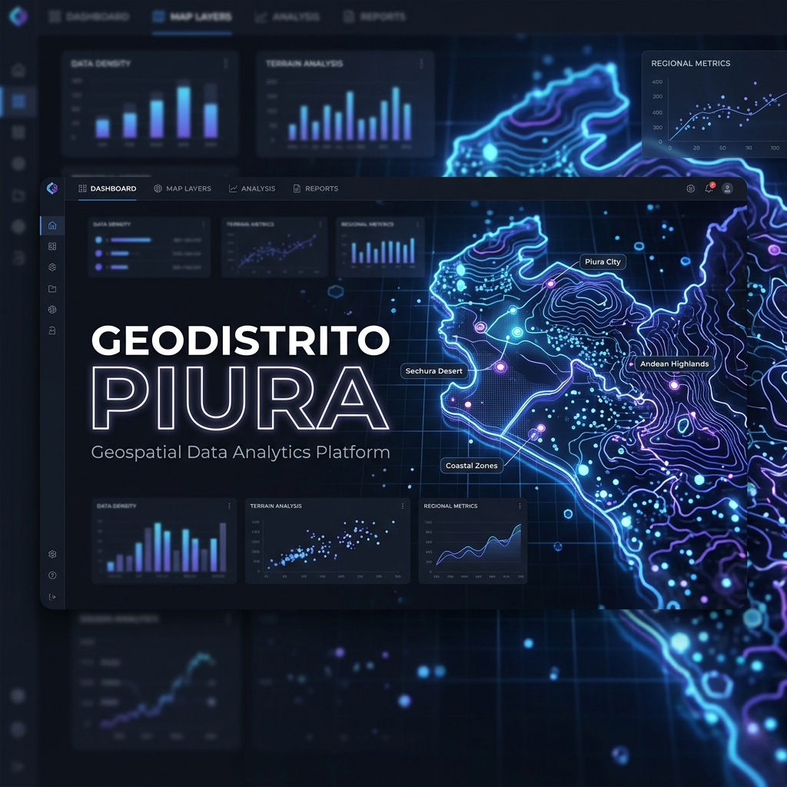

# GeoDistrito Piura 🗺️



**GeoDistrito Piura** es una herramienta de análisis geoespacial de alto rendimiento diseñada para la clasificación automática de clientes y puntos de interés dentro de los 65 distritos y 8 provincias de la región de Piura, Perú.

Esta aplicación permite a empresas de logística, distribución y retail cargar archivos de datos (Excel) y visualizar instantáneamente la distribución geográfica de sus operaciones, optimizando la toma de decisiones basada en territorio.

## ✨ Características Principales

- **Clasificación Espacial Avanzada**: Algoritmo *Point-in-Polygon* (PiP) optimizado con comprobación de *Bounding Box* para procesar miles de puntos en milisegundos.
- **Cartografía Oficial**: Integración de límites distritales actualizados basados en fuentes del INEI.
- **Visualización Interactiva**: Mapas de calor y clústeres dinámicos utilizando Leaflet.js.
- **Interfaz Dark Mode Premium**: Diseño moderno, responsivo y orientado a la productividad.
- **Análisis Estadístico**: Resúmenes automáticos por provincia y top distritos con mayor concentración.
- **Exportación de Datos**: Genera archivos Excel procesados con la clasificación territorial incluida.

## 🚀 Instalación y Uso

### Uso Local
1. Clona este repositorio:
   ```bash
   git clone https://github.com/tu-usuario/geodistrito-piura.git
   ```
2. Abre `index.html` en tu navegador (preferiblemente usando un servidor local como Live Server en VS Code).

### Despliegue
Esta aplicación es puramente client-side, por lo que es ideal para ser desplegada en **GitHub Pages**, Vercel o Netlify sin necesidad de configuración adicional.

## 🛠️ Tecnologías Utilizadas

- **Core**: HTML5, CSS3 (Custom Variables), ES6 Modules.
- **Mapas**: [Leaflet.js](https://leafletjs.com/) + [MarkerCluster](https://github.com/Leaflet/Leaflet.markercluster).
- **Datos**: [SheetJS (XLSX)](https://sheetjs.com/) para el procesamiento de Excel.
- **Geometría**: GeoJSON dinámico hospedado en GitHub.
- **Tipografía**: Inter & JetBrains Mono vía Google Fonts.

## 📁 Estructura del Proyecto

```text
GEODISTRITO/
├── assets/         # Recursos visuales y banner
├── css/            # Estilos CSS modulares
├── js/             # Lógica de la aplicación
│   ├── app.js        # Orquestador principal
│   ├── config.js     # Configuración y constantes
│   ├── state.js      # Gestión de estado centralizado
│   ├── processor.js  # Lógica de clasificación y Excel
│   ├── map-engine.js # Motor de renderizado de mapas
│   ├── ui-manager.js # Control de la interfaz y DOM
│   └── utils.js      # Utilidades geométricas y auxiliares
├── index.html      # Punto de entrada principal
└── README.md       # Documentación
```

## 📄 Licencia

Este proyecto está bajo la Licencia MIT. Consulta el archivo [LICENSE](LICENSE) para más detalles.

---
Desarrollado con ❤️ para la comunidad de análisis de datos de Piura.
